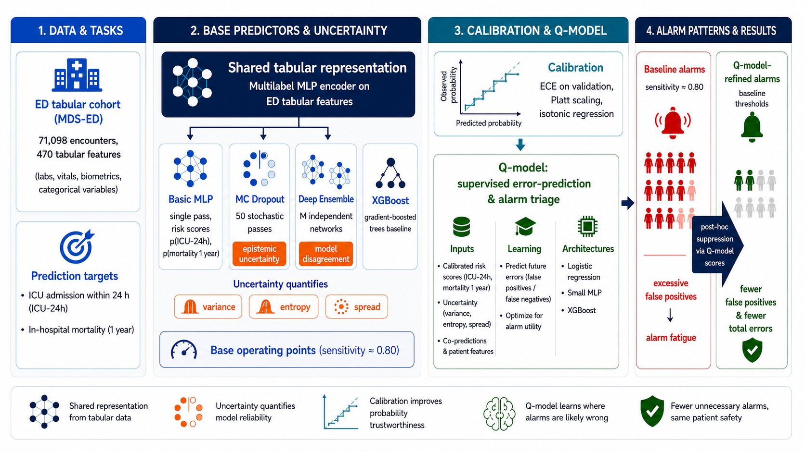

## A Model-Agnostic Framework for Post-Hoc False-Alarm Reduction in Clinical Prediction

**Yeji Lee, Keyhyun Ku, Taki Djebbar, Juan Miguel Lopez Alcaraz, Nils Strodthoff** — Carl von Ossietzky Universität Oldenburg

## Overview

Clinical early-warning systems are designed to flag patients at risk of deterioration before an adverse event occurs. In practice, achieving a high-sensitivity operating region for outcomes such as ICU admission within 24 hours or 365-day mortality often requires a low decision threshold, which can substantially increase false-positive alarms. Excessive false alarms may contribute to alarm burden and reduce trust in clinical decision-support systems.

Predictive uncertainty, including MC Dropout and Deep Ensemble summaries, has been proposed as a signal for filtering unreliable alarms under the assumption that correct alarms combine high predicted risk with low uncertainty. Our retrospective analyses indicate that this assumption can break down in high-sensitivity operating regions: true events frequently occur at intermediate-to-high uncertainty, while some false-positive alarms receive low uncertainty estimates.

We introduce the **Q-model**: a lightweight, model-agnostic secondary classifier that estimates the probability that a base-model decision is incorrect. It uses calibrated risk scores, uncertainty summaries when available, and encounter-level clinical features. Rather than applying uncertainty as a hard rejection rule, the Q-model treats it as one learned feature among several for post-hoc alarm triage. It suppresses base-positive alarms with high predicted error probability while keeping the base-model probability threshold fixed; the Q-score threshold is selected on validation data to target sensitivity of approximately 0.80.

We evaluate the framework on the **MDS-ED** benchmark, derived from MIMIC-IV and MIMIC-IV-Ext, for ICU admission within 24 hours (ICU-24h; prevalence 12.2%) and 365-day mortality (prevalence 13.8%). We consider four base predictors: BasicMLP, MC Dropout, Deep Ensemble, and XGBoost.

## Why Q-models

1. **“High-risk, low-uncertainty” is not a reliable alarm filter.** Under high-sensitivity operating conditions, true positives and false positives overlap substantially across the uncertainty range. Clinically relevant events can occur in intermediate-to-high uncertainty regions rather than concentrating only among low-uncertainty predictions.

2. **Hard uncertainty cutoffs can remove true events.** A global “reject if uncertain” rule can suppress alarms for difficult but clinically relevant cases. Conversely, false-positive alarms may occur at low uncertainty, so uncertainty alone does not reliably identify alarms that should be removed.

3. **Uncertainty can be used as a learned triage feature.** The Q-model combines calibrated risk scores, encounter features, and uncertainty summaries in a supervised classifier. This lets the secondary model learn combinations associated with base-model errors rather than assuming a monotonic relationship between uncertainty and alarm correctness.

4. **The framework was evaluated across endpoints and model families.** We applied the same post-hoc Q-model design to ICU-24h admission and 365-day mortality, using four heterogeneous base predictors. Q-score thresholds were selected on validation data to target sensitivity of approximately 0.80; final test-set operating characteristics varied modestly between pipelines.

## Results

### ICU-24h prediction

| Model | \(\tau\) | \(q_{\mathrm{thr}}\) | Best Q-model | Sensitivity | Specificity | Error AUROC | FP Reduction | Total Reduction |
|---|---:|---:|---|---:|---:|---:|---:|---:|
| BasicMLP | 0.09 | 0.83 | Single MLP | 0.822 | 0.842 | 0.891 | 1.18% | 0.62% |
| Deep Ensemble | 0.11 | 0.77 | Single MLP | 0.804 | 0.866 | 0.909 | 3.66% | 2.51% |
| MC Dropout | 0.13 | 0.85 | Ensemble XGB | 0.801 | 0.862 | 0.932 | 3.55% | 2.66% |
| XGBoost | 0.10 | 0.94 | Single XGB | 0.804 | 0.859 | 0.912 | 0.53% | 0.11% |

### 365-day mortality prediction

| Model | \(\tau\) | \(q_{\mathrm{thr}}\) | Best Q-model | Sensitivity | Specificity | Error AUROC | FP Reduction | Total Reduction |
|---|---:|---:|---|---:|---:|---:|---:|---:|
| BasicMLP | 0.10 | 0.87 | Single XGB | 0.823 | 0.730 | 0.935 | 1.74% | 1.45% |
| Deep Ensemble | 0.13 | 0.78 | Single MLP | 0.789 | 0.774 | 0.915 | 15.87% | 11.65% |
| MC Dropout | 0.13 | 0.78 | Ensemble MLP | 0.836 | 0.720 | 0.918 | 1.87% | 1.48% |
| XGBoost | 0.09 | 0.91 | Single XGB | 0.801 | 0.743 | 0.924 | 16.67% | 12.35% |

> Q-score thresholds were selected on the validation split to maximize specificity subject to sensitivity \(\geq 0.80\), then applied unchanged to the held-out test split. Test sensitivity can therefore differ slightly from the validation target. False-positive and total-error reductions are relative to each model's own unsuppressed baseline and are not directly comparable across base predictors.

## Conclusions

1. **Predictive uncertainty did not consistently align with alarm correctness at high-sensitivity operating points.** Across both endpoints, true events frequently occurred in intermediate-to-high uncertainty regions, while some false-positive alarms had low uncertainty.

2. **Q-model triage reduced false-positive alarms while generally retaining the validation-selected operating region.** False-positive reductions reached 3.66% for ICU-24h prediction and 16.67% for 365-day mortality. Test-set sensitivity was generally near 0.80, although the Deep Ensemble mortality configuration fell modestly below the validation target.

3. **The largest false-positive reductions occurred for 365-day mortality.** XGBoost and Deep Ensemble achieved 16.67% and 15.87% false-positive reductions, respectively. These improvements should be interpreted together with their corresponding sensitivity and false-negative trade-offs.

4. **Feature-attribution profiles differed by base architecture.** For models with native predictive-distribution summaries, uncertainty features could contribute strongly to Q-model error prediction. For models without such summaries, calibrated probability features were more prominent. These attributions describe fitted Q-model behavior and do not establish causal feature importance.

5. **The framework showed retrospective utility across two prediction horizons and four base-model families on one benchmark.** External validation, recalibration, and prospective workflow evaluation are needed before clinical deployment.

## Scope and limitations

This repository reports retrospective experiments on a single benchmark derived from MIMIC-IV and MIMIC-IV-Ext. The Q-model training data use base-model outputs produced on the base-model training split. The five-member Q-model ensemble reduces dependence on a single secondary-model fit, but it does not generate out-of-fold base-model predictions for Q-model training.

Accordingly, these results should be interpreted as benchmark-based evidence for post-hoc alarm triage rather than evidence of clinical effectiveness, generalizability to other institutions, or deployment readiness.
